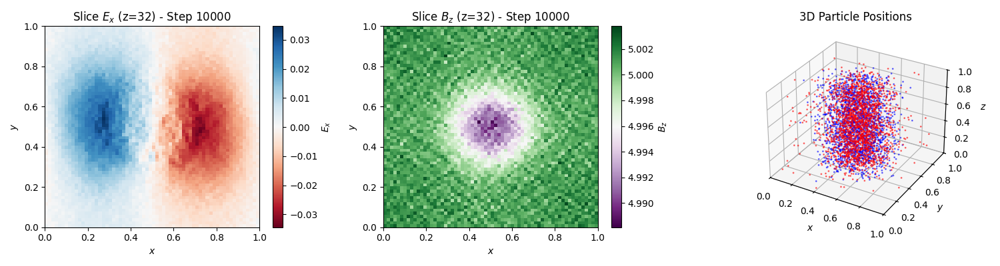

markdown
# 3D Electromagnetic Particle-In-Cell (EM-PIC) Simulation
**Topic:** Localized Plasma Expansion in a Background Magnetic Field

> **📘 Book Teaser & Proof of Concept**
> This repository contains a selected, standalone sample code from the upcoming textbook:
> ***"Introduction to Particle-in-Cell (PIC) Simulation with Python"***
> **Author:** Dr. Mohamad Reza Ghanbari
> 
> *Note: To protect the intellectual property of the forthcoming publication, only this specific 3D Electromagnetic PIC module is publicly hosted. The full repository, containing 11 chapters of hybrid, fluid, and AI-driven plasma simulations, will accompany the published book.*

## 📌 Physics Overview
This script models the expansion of a localized, quasi-neutral plasma cloud (consisting of electrons and ions) into a vacuum region under the influence of a strong, constant background magnetic field ($B_z = 5$). 

The simulation captures complex kinetic effects, including:
*   Charge separation and ambipolar electric field generation during expansion.
*   Diamagnetic cavity formation.
*   Gyromotion and finite Larmor radius (FLR) effects.

## 🚀 Algorithmic & Technical Highlights
The code provides a fully kinetic, 3D electromagnetic solver written from scratch. It bridges the gap between readable Python code and C-level execution speeds.

**Key Computational Features:**
*   **Grid Architecture:** 3D Staggered Yee Grid ($64 \times 64 \times 64$) for divergence-free EM field evolution.
*   **Initial Field Solver:** 3D FFT-based Poisson solver mapped accurately to the staggered Yee grid.
*   **Particle Pusher:** 3D Boris algorithm ensuring robust, volume-preserving integration in complex EM fields.
*   **Field Interpolation (Gather):** Custom Trilinear interpolation tailored strictly for Yee grid offsets.
*   **Strict Charge Conservation (Scatter):** Implementation of the highly complex **Villasenor-Buneman (VB) trajectory-splitting method**. This rigorously satisfies the continuity equation without requiring computationally expensive Poisson corrections.
*   **Maxwell Solver:** FDTD (Finite-Difference Time-Domain) leapfrog integration utilizing Faraday's and Ampere's laws.
*   **Performance Optimization:** Core computational bottlenecks (Pushers, Interpolations, VB Deposition) are heavily accelerated using **Numba (`@njit`)** Just-In-Time compilation.

## 📊 Simulation Output (Step 10000)
The code includes real-time diagnostics, plotting 2D mid-plane slices of the macroscopic fields alongside a 3D scatter distribution of the macro-particles.


*Figure: Simulation state at t = 10000 \dt. **(Left)** Mid-plane slice of the longitudinal electric field Ex showing charge separation. **(Center)** Mid-plane slice of the magnetic field Bz demonstrating field perturbation. **(Right)** 3D spatial distribution of electrons (blue) and ions (red).*

## ⚙️ Dependencies & Usage
The code is designed to run in a standard scientific Python environment.

**Requirements:**
```bash
pip install numpy numba matplotlib

**Execution:**
Save the script (e.g., as `3d_em_pic.py`) and run:
bash
python 3d_em_pic.py
*(Note: Initial JIT compilation by Numba will take a few moments during the first time-step setup. Subsequent loop iterations will execute at compiled speeds.)*

## 📬 Contact & Academic Profile
**Dr. Mohamad Reza Ghanbari**
*   Plasma Physics Researcher & Computational Physicist
*   **Focus:** PIC/Fluid Simulations, Laser-Plasma Interaction, Plasma Instabilities, High-Performance Computing (HPC) in Python.
*   [Google Scholar Profile](https://scholar.google.com/citations?user=l4aYKpAAAAAJ&hl=en)

---
*If you are an acquisitions editor, technical reviewer, or academic researcher interested in the complete manuscript of "Introduction to Particle-in-Cell (PIC) Simulation with Python," please feel free to reach out.*


***
